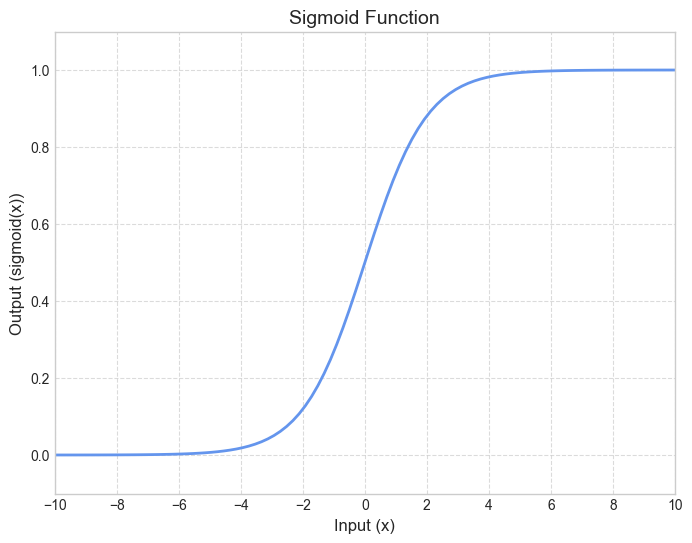

# 2. 로지스틱 회귀

매우 효율적인 확률 계산 메커니즘

반환된 확률을 두 방법중 하나로 사용할 수 있다.

1. 반환값 그대로 적용한다. 0.932 → 93.2%
2. 바이너리 카테고리로 변환한다. `True` or `False` 

### 시그모이드 함수

표준 로지스틱 함수(시그모이드 함수):  $f(x) = \frac{1}{1 + e^{-x}}$ 

입력값 `x`가 증가할수록 시그모이드 함수의 출력값은 `1`에 가까워지지만, 도달하지는 않는다.

로지스틱 회귀 모델의 선형 방정식 : $z = b + w_1x_1 + w_2x_2 + … + w_Nx_N$

- $z$: 로그 오즈, 선형 방정식의 출력
- $b$: 편향
- $w_1, w_2, …w_N$: 가중치
- $x$: feature

시그모이드 함수의 z값으로 전달되어 0~ 1의 확률이 생성된다.

$y' = \frac{1}{1 + e^{-z}}$

### 손실 및 정규화

- 로지스틱 회귀 모델은 제곱 손실($L_2$)이 아닌 로그 손실을 손실 함수로 사용
- 정규화 적용이 과적합을 방지하는 데 중요한 역할을 한다.

**로그 손실**

로지스틱 회귀 모델에서, $z$ 값이 0에 가까운 곳에서의 증감은 큰 y의 변화를 일으킨다. 

| **입력** | **로지스틱 출력** | **필요한 정밀도 자릿수** |
| --- | --- | --- |
| 5 | 0.993 | 3 |
| 6 | 0.997 | 3 |
| 7 | 0.999 | 3 |
| 8 | 0.9997 | 4 |
| 9 | 0.9999 | 4 |
| 10 | 0.99998 | 5 |

$Log \space Loss = \sum_{(x,y)\in D} -ylog(y') - (1 - y)log(1 - y')$

- $(x, y) \in D$: (x, y) 쌍인 라벨이 있는 예가 많이 포함된 데이터 세트
- $y$: 라벨이 있는 예의 라벨
- $y'$: x의 특성 집합을 고려할 때 모델의 예측 - (0~1)

**로지스틱 회귀의 정규화**

정규화는 학습 중에 모델 복잡성에 페널티를 적용하는 메커니즘. 정규화가 없으면 모델에 많은 수의 특성이 있는 경우 손실이 0으로 계속 이동하여, 다음 두가지 중 하나를 사용해 복잡성을 줄인다.

- $L_2$정규화
- 조기 중단