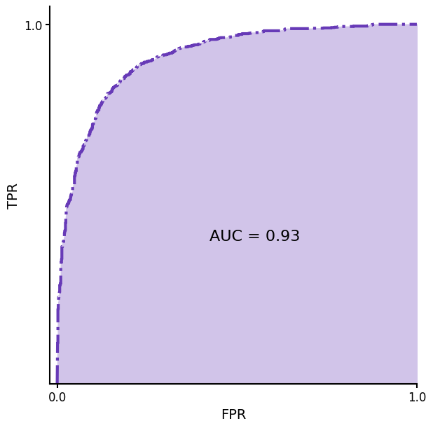

# 3. 분류 - **Classification**

확률이 아닌 카테고리를 출력하는 경우 사용한다.

스팸 탐지 시나리오에서, 로지스틱 회귀 모델의 예측값이 0.5 일 경우, 스팸일 확률이 50% 고 0.7 일 경우 70%다.

이 경우 출력을 스팸 과 스팸 아님 두 카테고리중 하나로 분류하려면, 분류 임곗값(classification threshold) 이라고 하는 임계값 확률을 선택해야 한다. 이를 초과하는 확률은 positive class, 다른 하나는 negative class 에 할당된다.

### 혼동 행렬

모델의 예측과 실제 값 사이의 관계를 4가지 행렬로 분류한다.

|  | **실제 양성** | **실제 음성** |
| --- | --- | --- |
| **Positive 예측** | **참양성 (TP)**: 스팸 이메일이 스팸 이메일로 올바르게 분류된 경우 | **거짓양성 (FP)**: 스팸이 아닌 이메일이 스팸으로 잘못 분류된 경우. |
| Negative 예측 | **거짓음성 (FN)**: 스팸 이메일이 스팸이 아닌 것으로 잘못 분류된 경우 | **참음성 (TN)**: 스팸이 아닌 이메일이 스팸이 아닌 것으로 올바르게 분류된 경우 |

**임곗값이 참양성, 거짓양성, 거짓음성에 미치는 영향**

임계값에 따라 **참양성, 거짓양성, 거짓음성 의 수가 달라진다.**

- **임계값을 높이면 (엄격하게)**: 확실한 것만 Positive로 판단. **FP(거짓 양성)가 줄어든다.** (정밀도 Precision 상승) 대신 어중간한 Positive를 놓칠 수 있다. (FN 증가, 재현율 Recall 하락)
    - **예**: 중요한 메일이 스팸함에 빠지면 절대 안 되는 경우.
- **임계값을 낮추면 (관대하게)**: 조금이라도 의심되면 Positive로 판단. **FN(거짓 음성)이 줄어든다.** (재현율 Recall 상승) 대신 멀쩡한 것을 Positive로 잘못 판단할 수 있다. (FP 증가, 정밀도 Precision 하락)
    - **예**: 암 진단. 놓치는 환자가 있으면 안 되므로, 정상인 사람을 일단 의심 환자로 분류하더라도 모든 가능성을 찾아내는 게 중요.

임계값을 정하는 것은 단순히 기술적인 문제가 아니라, **"어떤 실수를 더 피하고 싶은가?"에 대한 비즈니스적인 결정**

## Accurancy(정확성), **recall(**재현율), 정밀도(**precision
),** 관련 측정항목

### 정확성

양성 또는 음성 여부와 관계없이 올바른 모든 분류의 비율

$Accurancy = \frac{올바른\space classifications}{전체 \space classifications} = \frac{TP + TN}{TP + TN + FP + FN}$

- 완벽한 모델은 FP, FN 이 0이므로, Accurancy = 1.0 이다.

### 재현율(참양성율)

Positive로 분류된 양성 중 올바르게 분류된 양성의 비율

$Recall (or TPR) = \frac{올바르게 분류된 positives}{모든 실제 positives} = \frac{TP}{TP + FN}$

- FN = 모델의 답변이 음성(Negative) 일때 틀린 경우, 즉 실제로는 양성인데 음성으로 예측한 경우
- 전체 스팸 중 올바르게 분류된 스펨 이메일의 비율 → **감지 확률**

### 거짓 양성율(FPR)

모든 음성(Negative) 중 양성으로 잘못 분류된 비율

$FPR = \frac{양성으로 \space잘못 \space분류된 \space negative}{모든 negatives} = \frac{FP}{FP + TN}$

- 완벽한 모델은 FP 가 0이므로 0
- negative 의 수가 적은 불균형 데이터 세트에서는 의미없다.

### 정밀도

양성으로 분류된 것들 중 올바르게 양성으로 분류한 비율

$Precision = \frac{올바르게 분류된 positives}{positive로 분류된 모든것} = \frac{TP}{TP + FP}$

- 거짓양성(FP)가 줄어들 수록 정밀도가 개선
- 거짓음성(FN)이 줄어들 수록 재현율이 개선
- 임계값 상승 → 거짓 양성 하락, 거짓 음성 상승
- 임계값 하락 → 거짓 양성 상승, 거짓 음성 하락

→ 재현율과 정밀도는 Trade Off 관계 인듯

임계값 올라가면 실제로는 음성인데 양성으로 잘못 판단하는 경우가 줄음(FP) → 정밀도 상승

- 하지만 실제로는 양성(스팸) 인데 음성으로 잘못 판단하는 FN 증가 → 재현율 하락

- 계속 헷갈려서 정리
    
    `(정상) E: 0.1점` `(스팸) D: 0.4점` `(정상) C: 0.6점` `(스팸) B: 0.65점` `(스팸) A: 0.9점`
    
    **상황 1: 임계값 = 0.5 (기본 설정)**
    
    ABC : 스팸, DE : 정상
    
    거짓 양성(FP): C 
    
    거짓 음성(FN): D
    
    FP, FN = 1개
    
    **상황 2: "임계값을 0.7로 올린다" (더 엄격하게)**
    
    스팸: A, 정상: BCDE
    
    거짓 양성(FP): 없음  - 1개 감소
    
    거짓 음성(FN): B, D - 1개 증가

## ROC 및 AUC

### **Receiver-operating characteristic curve: ROC**

- 모든 임계값에서의 모델 성능을 시각화
- 성능 측정을 위한 정량화된 값은 ROC 그래프의 면적을 나타내는 AUC 이다.

### **Area under the curve :AUC**

- X축은 FPR - 거짓 양성율, Y축은 TPR - 참양성율
- 임계값의 변화에 따른 x, y 값의 변화를 시각화 한 그래프
- AUC 가 높을수록 좋은 모델이다.
- 임계값을 낮추면 TPR, FPR 둘다 1에 가까워 지기 때문에 의미가 없고, 그래프의 왼쪽 부분이 높을수록 - 이부분은 임계값이 높은, FPR이 낮은 부분 - 좋은 모델이다.

## 예측 편향 - **Prediction bias**

- 모델의 예측의 평균과 데이터 내 실제 레이블의 평균 간의 차이
- 이메일의 5%가 스팸인 데이터 세트의 경우 데이터 세트의 레이블 평균은 0.05이고, 모델 예측의 평균 또한 0.05 여야 한다. (예측 편향이 없다면)

### 예측 편향이 발생되는 경우

- 데이터 자체에 존재하는 편향이나 노이즈
- 너무 강한 정규화(regularization) → 모델이  과도하게 단순화 되어 필요한 복잡성을 읽어버린 경우
- 모델 훈련 파이프라인의 버그
- 모델에 제공된 피처 세트가 해당 작업을 수행하기 불충분한 경우

즉

1. 편향된 데이터
2. 과도한 단순화
3. 훈련 과정의 버그
4. 불충분한 정보

## 다중 클래스 분류 - Multi-class classification**

- binary classification 을 두개 이상의 클래스로 확장한것
- A, B, C 레이블에서, A + B 와 C 레이블을 사용하여 예제를 분류하는 이진 분류기를 만들 수 있다.
- 그 후 A + B 레이블을 가진 예제들을 A 레이블과 B 레이블을 사용해 재분류하는 두번째 이진 분류기를 만들 수 있다.

### 문제를 나눠서 푸는 방법

글에서 설명한 것처럼, 복잡한 객관식 문제를 간단한 O/X 퀴즈 여러 개로 나눠 풀 수도 있다.

예를 들어, `A`, `B`, `C` 세 반으로 학생을 나누는 문제가 있다면,

1. **1차 분류**: 먼저 "이 학생은 **C반인가, 아닌가(A 또는 B반인가)?**"라는 O/X 퀴즈
2. **2차 분류**: 여기서 'A 또는 B반'이라고 나온 학생들만 모아서 "이 학생은 **A반인가, B반인가?**"라는 O/X 퀴즈를 한 번 더