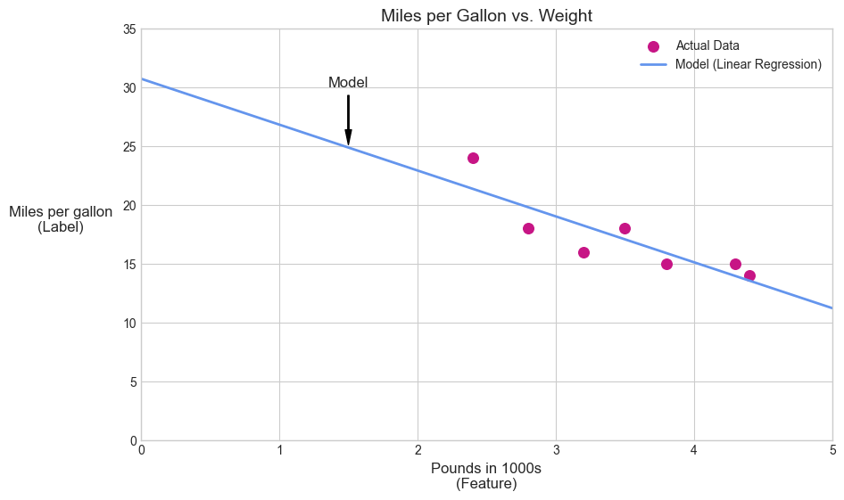

# 1. 선형회귀

- 변수 간의 관계를 찾는 데 사용되는 통계 기법
- ML 컨텍스트 에서 선형회귀는 특성과 라벨의 관계를 찾는다.

자동차의 무게로 연비를 예측하려고 하고, 다음과 같은 데이터 셋이 있다고 가정

| 파운드 (1,000단위, 지형지물) | 갤런당 마일(라벨) |
| :-----------------------: | :-------------: |
|           3.5           |       18        |
|           3.69          |       15        |
|           3.44          |       18        |
|           3.43          |       16        |
|           4.34          |       15        |
|           4.42          |       14        |
|           2.37          |       24        |

그래프의 실제 점들을 통과하는 선을 그려서 자체 모델을 만들 수 있다.

---
## 선형 회귀식
대수학적으로 이 모델은 $y = mx + b$ 로 정의된다.

* $y$ : 예측하려는 값 → 여기서는 마일 당 갤런
* $m$ : 선의 기울기
* $x$ : 입력값인 파운드
* $b$ : y절편

ML 에서는 다음과 같다.
$y' = b + w_1x_1$

* $y'$ : 예측된 라벨
* $b$ : 모델의 편향. 대수방정식에서 $y$절편과 같으며, $w_0$으로도 표현된다. 모델의 매개변수 이며 학습 중에 계산된다.
* $w_1$ : 특성의 가중치. 대수방정식의 기울기와 같은 개념이다. 모델의 매개변수이며 학습 중에 계산된다.
* $x_1$ : 특성 - 입력이다.

---
## 여러 features가 있는 모델

5가지의 특성을 사용하는 모델
$y' = b + w_1x_1 + w_2x_2 + w_3x_3 + w_4x_4 + w_5x_5$

* $x_1$ : pounds
* $x_2$: 배기량
* $x_3$: 가속
* $x_4$: 실린더 수
* $x_5$: 마력

---
## 선형 회귀: 손실
모델의 예측이 얼마나 잘못되었는지 나타내는 숫자 항목
머신러닝에서 손실은 방향은 중요하지 않고, 값 간의 거리만 측정한다. 즉 부호를 제거하기 위해 절댓값을 취하거나 제곱한다.

### 손실 유형
* **$L_1$ 손실**: 예측값과 실제값 간의 차이의 절대값 합계: $\sum | \text{실제 값} - \text{예측 값} |$
    * **평균 절대 오차(MAE)**: L1손실의 평균
* **$L_2$ 손실**: 예측값과 실제 값 간의 제곱 차이의 합계: $\sum(\text{실제 값} - \text{예측 값})^2$
    * **평균 제곱 오차(MSE)**: L2 손실의 평균

### 손실 선택
* **MSE**: 모델이 이상치에 더 가깝지만 대부분의 데이터 포인터와 멀리 떨어져 있음
* **MAE**: 모델이 이상치에서 더 멀리 떨어져 있지만 데이터 포인터와 가까이 있음