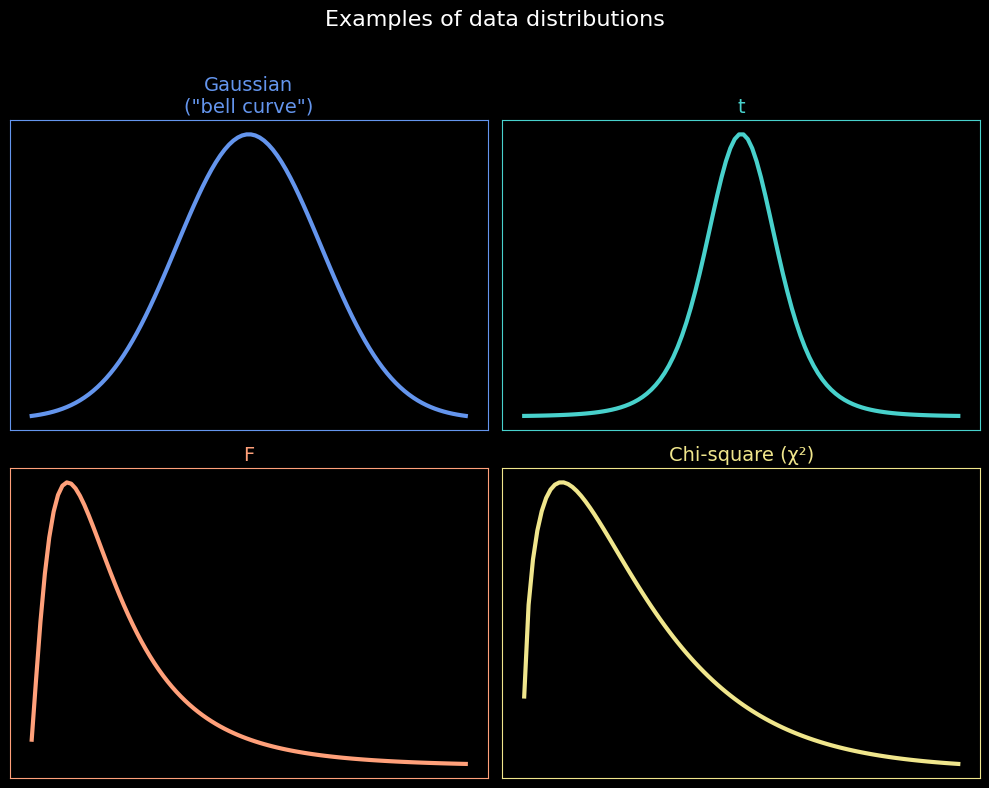
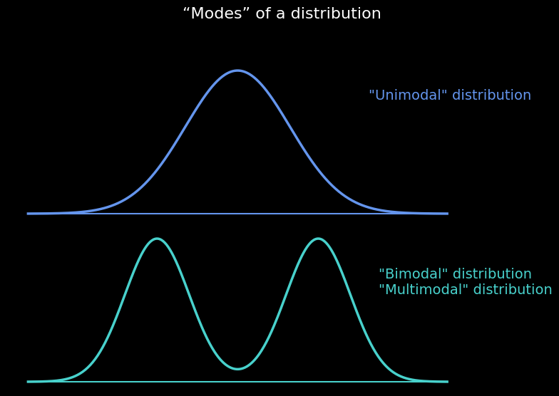

## 1. 기술 통계학 (Descriptive Statistics) vs. 추론 통계학 (Inferential Statistics)

* 기술 통계학과 추론 통계학의 차이점
* 이 둘을 명확히 구분하는 것이 왜 중요한가
* **Statistical homonym** - 통계학적 동음이의어

---

### 기술 통계학 (Descriptive Statistics)
데이터셋의 특징을 설명합니다.

**주요 지표:**
* 평균 (Mean), 중앙값 (Median), 최빈값 (Mode)
* 분산 (Variance)
* 왜도 (Skewness), 첨도 (Kurtosis)
* 분포 모양 (Distribution shape)
* 스펙트럼 (Spectrum)

**Notes:** No relation to population; no generalization to other datasets or groups.
→ **비교하거나 일반화하지 않음**

---

### 추론 통계학 (Inferential Statistics)
데이터셋의 특징을 사용하여 모집단에 대한 주장을 펼칩니다.

**주요 방법:**
* P-값 (P-value)
* T/F/카이제곱 값 (T/F/chi-square value)
* 신뢰 구간 (Confidence intervals)
* 가설 검정 (Hypothesis testing)

**Notes:** The entire purpose is to relate data features to populations or generalize to other groups!
→ **다른 그룹과 비교하거나 샘플에서 전체로 일반화**

---

## 2. 정확도 (Accuracy), 정밀도 (Precision), 분해능 (Resolution) 

* The terms accuracy, precision, and resolution
* Why these concepts are important

* **정확도 (Accuracy):** 측정값이 실제 참값(Truth)과 얼마나 가까운지를 나타냅니다. (편향(bias)과 반비례 관계)
* **정밀도 (Precision):** 각 측정값이 얼마나 일관성 있게(확실하게) 나타나는지를 의미합니다. (분산(variance)과 반비례 관계)
* **분해능 (Resolution):** 단위 측정(시간, 공간, 개체 등)당 데이터 포인트의 수를 나타냅니다.

# 3. Data distribution

## What a “data distribution” means

데이터 분포는 데이터셋 내의 값들이 어떻게 퍼져 있는지를 설명하는 방식입니다. 즉, 어떤 값이 얼마나 자주 나타나는지를 보여주는 패턴이나 모양을 의미합니다. 

---

## Examples of different distributions

데이터를 설명하는 데 사용되는 여러 유형의 분포가 있습니다.

* **정규 분포 (Gaussian distribution)**: "벨 커브(bell curve)"라고도 불리며, 평균 주변에 데이터가 집중되고 양쪽으로 갈수록 대칭적으로 감소하는 형태입니다. 자연 현상이나 사회 현상에서 매우 흔하게 발견됩니다.
* **t-분포 (t-distribution)**: 정규 분포와 유사하지만, 표본 크기가 작을 때 사용되며 꼬리가 더 두꺼운 특징이 있습니다.
* **F-분포 (F-distribution)**: 두 분산의 비율을 비교할 때 주로 사용되며, 양의 값만 가지고 오른쪽으로 긴 꼬리를 가집니다.
* **카이제곱 분포 (Chi-square distribution, χ²)**: 범주형 데이터 분석(예: 적합도 검정, 독립성 검정)에 널리 사용됩니다. 자유도에 따라 모양이 변하며, 양의 값만 가지고 오른쪽으로 치우친 형태입니다.
* **멱법칙 분포 (Power-law distribution)**: 값의 크기나 세기에 반비례하여 데이터가 분포하는 경우를 말합니다. 예를 들어, 소수의 항목이 매우 높은 빈도를 차지하고, 대다수의 항목은 낮은 빈도를 보이는 현상에서 나타납니다 (예: 부의 분배, 단어 빈도).

---

## How distributions are used in statistics

통계학에서 분포는 다음과 같은 다양한 용도로 사용됩니다:

1.  **데이터 요약**: 데이터의 중심 경향성(평균, 중앙값 등), 산포도(분산, 표준편차 등), 그리고 전반적인 형태를 파악합니다.
2.  **확률 계산**: 특정 값이나 범위의 값이 나타날 확률을 계산합니다.
3.  **가설 검정**: 표본 데이터를 기반으로 모집단에 대한 가설을 검정합니다. 예를 들어, 두 그룹 간의 평균 차이가 통계적으로 유의미한지 등을 판단합니다.
4.  **모델링**: 실제 현상을 수학적으로 모델링하고 미래 값을 예측하는 데 사용됩니다.
5.  **추론**: 표본의 특성으로부터 모집단의 특성을 추정합니다.

---

## Who cares about distributions?

데이터 분포에 관심을 가져야 하는 이유는 다음과 같습니다:

* **대부분의 통계 절차는 분포에 대한 가정에 기반합니다 (Most statistical procedures are based on assumptions about distributions).**
    * 예를 들어, t-검정은 데이터가 정규 분포를 따른다고 가정하는 경우가 많습니다.
* **이러한 분포를 아는 것은 통계를 적절하게 적용하는 데 필요합니다 (Knowing these distributions is necessary for appropriately applying statistics).**
    * 데이터의 분포를 이해하면 적절한 통계 분석 방법을 선택하고 결과를 올바르게 해석하는 데 도움이 됩니다.
* **데이터 분포는 자연에 대한 통찰력을 제공합니다 (Data distributions provide insights into nature).**
    * 많은 물리적, 생물학적 시스템은 특정 분포를 사용하여 모델링됩니다 (Physical and biological systems are modeled using distributions). 예를 들어, 사람의 키나 측정 오차는 종종 정규 분포를 따릅니다.

---

## Segue to quantitative measures of distributions

데이터 분포의 특징을 더 정확하게 이해하기 위해 다양한 **정량적 측정치(quantitative measures)**를 사용합니다. 이러한 측정치에는 다음이 포함됩니다:

* **중심 경향성 측정치 (Measures of Central Tendency)**: 평균(mean), 중앙값(median), 최빈값(mode) 등 데이터의 중심을 나타냅니다.
* **산포도 측정치 (Measures of Dispersion/Variability)**: 범위(range), 분산(variance), 표준편차(standard deviation), 사분위수 범위(interquartile range) 등 데이터가 얼마나 퍼져 있는지를 나타냅니다.
* **형태 측정치 (Measures of Shape)**: 왜도(skewness)는 분포의 비대칭 정도를, 첨도(kurtosis)는 분포의 뾰족한 정도와 꼬리의 두께를 나타냅니다.

---

## Modes of a distribution

**최빈값(Mode)**은 데이터 분포에서 가장 빈번하게 나타나는 값, 즉 분포에서 가장 높은 봉우리를 의미합니다. 분포는 봉우리의 수에 따라 다음과 같이 분류될 수 있습니다.

* **단일 모드 분포 (Unimodal distribution)**: 분포에 봉우리가 하나만 있는 경우입니다. 위 이미지의 상단 그래프가 이에 해당하며, 가장 흔한 형태 중 하나입니다.
* **이중 모드 분포 (Bimodal distribution)**: 분포에 두 개의 뚜렷한 봉우리가 있는 경우입니다. 이는 데이터 내에 두 개의 서로 다른 하위 그룹이 존재할 수 있음을 시사합니다.
* **다중 모드 분포 (Multimodal distribution)**: 분포에 두 개 이상의 봉우리가 있는 경우를 통칭합니다. 이중 모드 분포는 다중 모드 분포의 한 예입니다. 위 이미지의 하단 그래프는 두 개의 봉우리를 가지므로 이중 모드이면서 다중 모드 분포에 해당합니다.

---

## Building up a data distribution

데이터 분포는 관찰된 데이터를 수집하고 정리함으로써 구축됩니다. 예를 들어, 어떤 실험이나 조사를 통해 얻은 값들을 모아 빈도표나 히스토그램으로 표현하면 해당 데이터의 분포를 시각적으로 파악할 수 있습니다.

### Example: Slow Loris Videos

* 질문: "슬로우 로리스 비디오를 몇 편이나 보셨나요?" (How many Slow Loris videos have you watched?)
    * 한 명은 8편을 봤습니다. (One have seen 8)
    * 다른 한 명은 14편을 봤습니다. (The other have seen 14)
* **이 실험의 데이터 유형 (What is the type of this experiment?)**: **비율 (Ratio)**
    * 측정된 값(8편, 14편)은 절대적인 0점(비디오를 전혀 보지 않음)이 존재하고, 값들 사이의 비율(예: 14편은 8편보다 1.75배 더 많이 봄)이 의미를 가지므로 비율 척도에 해당합니다.

---

## The shape of data distribution

데이터 분포의 모양은 데이터의 중요한 특징을 알려줍니다.

* 위의 "슬로우 로리스 비디오 시청 횟수"와 같은 경우, 데이터를 수집하면 **히스토그램**으로 나타내거나, 히스토그램의 막대 상단을 연결하는 **선을 이용**하여 시각화할 수 있습니다.
* 만약 "영상을 많이 본 사람보다 보지 않거나 적게 본 사람이 훨씬 많을 것"이라고 가정한다면, 데이터는 오른쪽으로 길게 꼬리를 가지는 비대칭적인 분포(오른쪽으로 치우친 분포)를 보일 가능성이 큽니다.
* 데이터 집합의 크기나 세기에 반비례하는 경우, 이를 "**멱법칙 분포(Power-law distribution)**"라고 합니다. 이는 소수의 항목이 대부분의 값을 차지하고, 다수의 항목이 적은 값을 차지하는 패턴을 보입니다.

